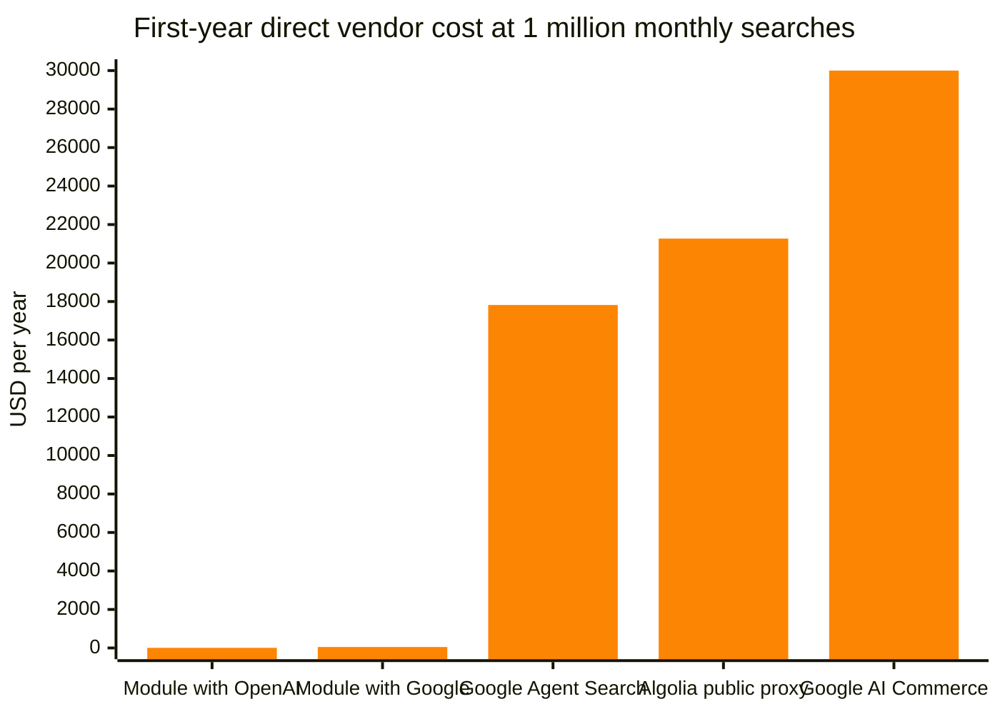
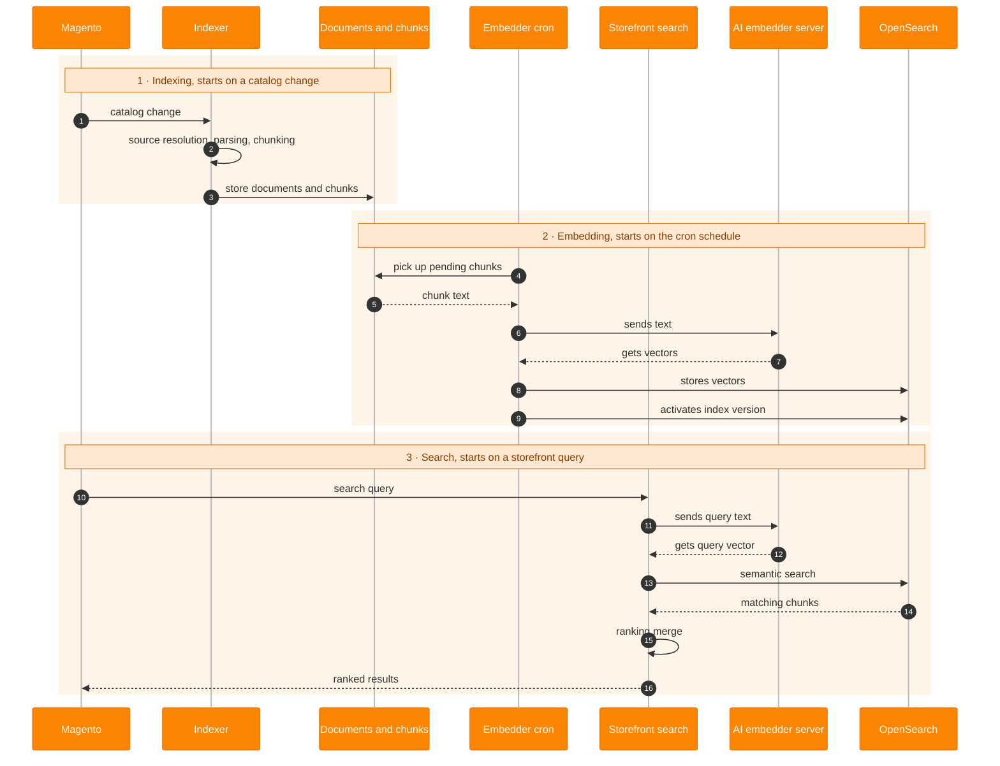
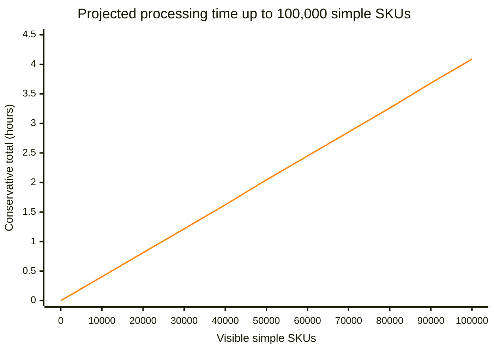
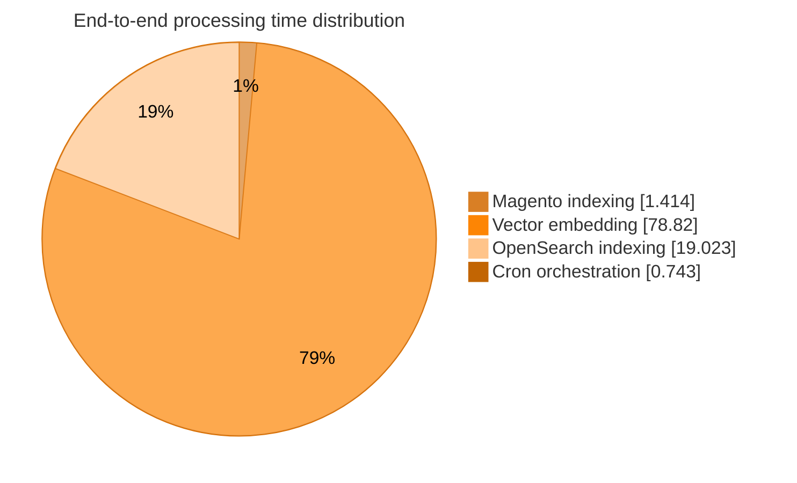

<p align="center">
  
</p>

<h1 align="center">Magento AI Search</h1>

<p align="center">
  <a href="https://github.com/DavidBelicza/Magento-AI-Search/actions/workflows/quality.yml"></a>
  <a href="https://codecov.io/gh/DavidBelicza/Magento-AI-Search"></a>
  <a href="https://packagist.org/packages/davidbel/magento-ai-search"></a>
  <a href="LICENSE"></a>
</p>

<p align="center">
  An <strong>AI provider-agnostic semantic search solution</strong><br>
  for <strong>Magento, Mage-OS, and Adobe Commerce</strong>.
</p>

> See the [User Guide](https://github.com/DavidBelicza/Magento-AI-Search/blob/main/docs/USER_GUIDE.md) for complete installation and configuration instructions.

> See the [Cost Analysis](https://github.com/DavidBelicza/Magento-AI-Search/blob/main/docs/COST_ANALYSIS.md) to learn how this module can save **up to $29,993 per year**.

## 💡 Motivation

What if there was a module using **Magento's default search engine** to provide **actual meaning-based AI search without breaking the default one**? This is that module.

Inspired by Google Cloud's Commerce AI Search, the module reads and chunks product descriptions, uses a remote AI server to **convert the text chunks into vectors**, then saves those vectors to **Magento's default search engine, OpenSearch**. This enables **intelligent search based on meaning rather than keyword or synonym matching**.

## 💰 Cost Analysis

This chart compares estimated first-year direct vendor costs for a catalog of 100,000 products in
two languages with 1 million submitted searches per month. The assumptions, calculations, pricing
sources, and limitations are documented in the
[Cost Analysis](https://github.com/DavidBelicza/Magento-AI-Search/blob/main/docs/COST_ANALYSIS.md).



The module bars appear almost flat because the managed services cost hundreds
or thousands of times more on the same linear scale.

## 🛍️ Use Cases

### Customer product discovery

Semantic search is most useful when shoppers describe a need, experience, or intended use instead
of entering the exact words used in the catalog. It works especially well when product descriptions
and dynamic documents contain rich, specific information.

| Store type | Useful product content | Example search |
|---|---|---|
| Consumer electronics | Compatibility details, technical features, setup instructions, and usage guidance | *comfortable headphones that block office noise* |
| Tea and specialty food | Flavor, aroma, origin, preparation, and recommended occasions | *a gentle floral tea for a calm evening* |
| Fashion and luxury | Fit, texture, materials, comfort, quality, mood, and occasion | *an elegant coat that feels soft and comfortable all day* |
| Home and furniture | Dimensions, materials, room type, style, comfort, and practical use | *a compact comfortable chair for a small reading corner* |
| Outdoor and sports | Activities, terrain, weather, durability, and performance characteristics | *waterproof shoes for long walks on wet rocky paths* |
| Technical and B2B catalogs | Applications, constraints, compatibility, operating conditions, and specialist terminology | *a compact pump suitable for corrosive liquids* |

### Catalog content quality review

Admin semantic-search testing can reveal weak product descriptions by showing whether representative
shopper queries find the expected products and text chunks. This is a content-quality signal, not a
measure of marketing effectiveness, which still requires conversion analytics or A/B testing.

The module produces stronger results when indexed product content clearly describes the benefits,
attributes, and use cases that shoppers are likely to search for.

## 🔍 What Semantic / AI Search Is

| Search query | Matching product descriptions |
|---|---|
| *coffee for cold winter mornings* | A rich dark roast with notes of cocoa and toasted spice.<br>A seasonal coffee blend with cinnamon, caramel, and a warming finish.<br>An insulated travel mug that keeps coffee hot throughout chilly days. |
| *big coats for small kids* | A roomy insulated parka for toddlers, with extra space for winter layers.<br>An oversized puffer coat for young children, with adjustable cuffs and a warm hood. |
| *gift for a home cook* | A balanced chef's knife for precise everyday preparation.<br>A durable bamboo cutting board with a deep juice groove.<br>A compact digital scale for accurate cooking and baking. |
| *I want to sleep better* | A weighted blanket designed for calm, comfortable nights.<br>Blackout curtains that reduce outside light in the bedroom. |
| *stay warm outdoors* | An insulated jacket designed for cold and windy conditions.<br>A breathable merino wool base layer for winter activities. |

## 🏗️ Architecture



- Magento's indexer detects product changes, reads the selected store-scoped content, splits
  it into chunks, and saves the documents and chunks locally.
- Scheduled workers send pending chunks to the AI server in batches, receive their vectors,
  and publish them to a versioned index in Magento's OpenSearch service.
- When a shopper searches, the AI server converts the query into a vector and OpenSearch
  finds products with similar meaning. Magento continues to handle the catalog query and
  result page.
- If semantic search is disabled or unavailable, the request falls back to Magento's default
  search.

### Reindexing workflow

Only key configuration changes trigger automatic full reindexing. The Admin UI flags these settings with tooltips for administrators.

| Reindexing mode | Product parsing | Text chunking | Vector embedding | Search indexing |
|---|---|---|---|---|
| Delta | Update documents for affected products | Parse and chunk changed documents | Embed only updated text chunks | Update index |
| Full | Update documents for all eligible products | (Re-)parse and (re-)chunk all documents | Embed all text chunks | Build new index |

## ⚙️ System requirements

### Distribution

| Distribution | Status |
|---|---|
| Magento Open Source | ✅ Supported |
| Adobe Commerce | ✅ Supported<br>ℹ️ Product Staging, Catalog Permissions, and B2B Shared Catalogs are not supported yet |
| Adobe Commerce on Cloud | ✅ Supported<br>ℹ️ Product Staging, Catalog Permissions, and B2B Shared Catalogs are not supported yet |
| Mage-OS | ✅ Supported |

### Magento

| Magento | PHP | OpenSearch | Status |
|---:|---:|---:|---|
| 2.4.9 | 8.5 | 3 | ✅ Supported |
| 2.4.9 | 8.5 | 2.19 | ✅ Supported |
| 2.4.9 | 8.4 | 3 | ✅ Supported |
| 2.4.9 | 8.4 | 2.19 | ✅ Supported |
| 2.4.8-p3+ | 8.4 | 3 | ✅ Supported |
| 2.4.8 | 8.4 | 2.19 | ✅ Supported |
| 2.4.8-p3+ | 8.3 | 3 | ✅ Supported |
| 2.4.8 | 8.3 | 2.19 | ✅ Supported |
| 2.4.7-p10 | 8.3 | 3 | ✅ Supported |
| 2.4.7-p5+ | 8.3 | 2.19 | ✅ Supported |

OpenSearch must include the k-NN plugin, which is bundled with the standard OpenSearch
distribution normally used with Magento.

### Storefront

| Storefront | Status |
|---|---|
| Luma | ✅ Supported |
| Hyvä | ❌ Not supported<br>ℹ️ Hyvä's layered navigation customization breaks Magento's default relevance sorting, which also affects semantic result ordering.<br>(Package: `hyva-themes/magento2-default-theme` `1.5.2`; issue: `position_category_*` replaces relevance sorting.) |
| Headless (GraphQL) | ✅ Supported |

### AI server

| Feature | Current support |
|---|---|
| Embedding models | ✅ Any model exposed through a supported endpoint (OpenAI text-embedding, Gemini Embedding, EmbeddingGemma, Cohere Embed, Voyage, Jina Embeddings, BGE, E5, GTE, Nomic Embed, Qwen Embedding, Mistral Embed, etc.) |
| API protocol | ✅ OpenAI-compatible APIs<br>✅ Configurable embedding endpoint URLs<br>✅ OpenAI hosted API<br>✅ Google Gemini OpenAI-compatible API<br>✅ LM Studio<br>✅ Ollama<br>✅ llama.cpp<br>✅ Google Gemini native API |
| Authentication | ✅ Unauthenticated endpoints<br>✅ Bearer-token authentication<br>✅ Google Gemini OpenAI-compatible API keys<br>✅ Google Gemini native API-key authentication |

## 📦 Install

```shell
composer require davidbel/magento-ai-search
bin/magento module:enable DavidBel_AiSearch
bin/magento setup:upgrade
```

Complete installation steps are available in the [User Guide](https://github.com/DavidBelicza/Magento-AI-Search/blob/main/docs/USER_GUIDE.md).

## 🔧 Settings

The module settings are available in **Stores > Settings > Configuration > AI Search**.

The module dashboard is available in **System > AI Search > Dashboard**.

Complete configuration instructions are available in the [User Guide](https://github.com/DavidBelicza/Magento-AI-Search/blob/main/docs/USER_GUIDE.md).

## 📊 Performance

### Catalog Scaling

The estimates are based on a cron job scheduled to run every `60 seconds`, with `100`
chunks per embedding batch, up to `3` concurrent embedding requests, and a maximum
worker runtime of `600 seconds`. Each generated description contained approximately
`1,500 estimated tokens` and produced around `5` chunks. The chunks averaged about
`300 estimated tokens`, with a maximum size of `350 tokens` and an overlap of `50 tokens`.

| Visible simple SKUs | Vectors | Active processing | Conservative total |
|---:|---:|---:|---:|
| 1,000 | 6,000 | 2m 14s | **2m 14s** |
| 10,000 | 60,000 | 22m 20s | **24m 20s** |
| 100,000 | 600,000 | 3h 43m 16s | **4h 5m 16s** |
| 1,000,000 | 6,000,000 | 1d 13h 12m 35s | **1d 16h 55m 35s** |

The measurements show predictable linear scaling under the tested configuration, proving
that the worker architecture can support larger, long-running catalog workloads.



These estimates describe an initial full ingestion or a deliberate full rebuild of the
product content used for search. In normal operation, only changed content is processed,
and product descriptions usually change far less often than prices or inventory. Processing
an entire catalog is therefore an occasional workload, such as during initial setup, major
content campaigns, or embedding configuration changes, rather than a daily requirement.

### Time Distribution

The processing configuration can be tuned further for larger catalogs. However, most of the
computational work is performed by the AI server. These measurements used a local development
AI server; production servers typically scale further.



## 📚 Documentation

- [User Guide](docs/USER_GUIDE.md)
- [Cost Analysis](docs/COST_ANALYSIS.md)
- [Solution Discovery](docs/SOLUTION_DISCOVERY.md)
- [Contributing Guide](CONTRIBUTING.md)
- [Security Policy](SECURITY.md)
- [Code of Conduct](CODE_OF_CONDUCT.md)
- [MIT License](LICENSE)
