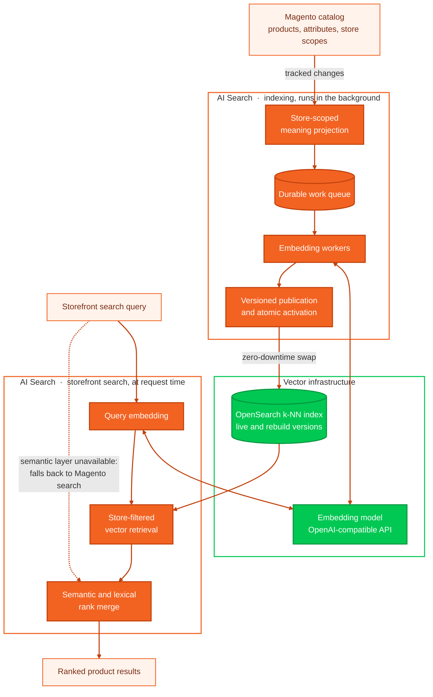

<!--
davidbel/ai-search by David Belicza
SPDX-License-Identifier: MIT
https://github.com/DavidBelicza/Magento-AI-Search
-->

# Magento AI Search

## 🏗️ Architecture



## ⚙️ System requirements

| Distribution | Status |
|---|---|
| Magento Open Source | ✅ Supported |
| Adobe Commerce | 🧪 To be tested |
| Adobe Commerce on Cloud | 🧪 To be tested |
| Mage-OS | 🧪 To be tested |

| Magento | PHP | OpenSearch | Status |
|---:|---:|---:|---|
| 2.4.9 | 8.5 | 3 | 🧪 To be tested |
| 2.4.9 | 8.5 | 2 | 🧪 To be tested |
| 2.4.9 | 8.4 | 3 | ✅ Supported |
| 2.4.9 | 8.4 | 2 | 🧪 To be tested |
| 2.4.8-p3+ | 8.4 | 3 | 🧪 To be tested |
| 2.4.8 | 8.4 | 2 | 🧪 To be tested |
| 2.4.8-p3+ | 8.3 | 3 | 🧪 To be tested |
| 2.4.8 | 8.3 | 2 | 🧪 To be tested |
| 2.4.7-p10 | 8.3 | 3 | 🧪 To be tested |
| 2.4.7 | 8.3 | 2 | 🧪 To be tested |

OpenSearch must include the k-NN plugin, which is bundled with the standard OpenSearch
distribution normally used with Magento.

## 📦 Install

```shell
composer require davidbel/ai-search
```
