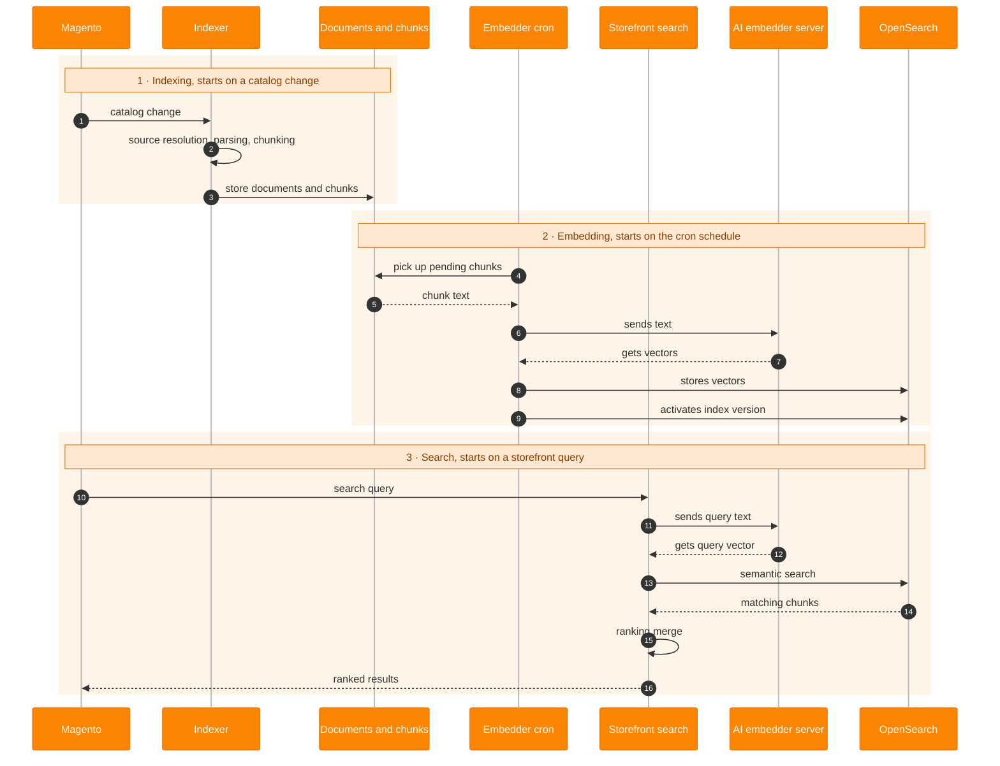
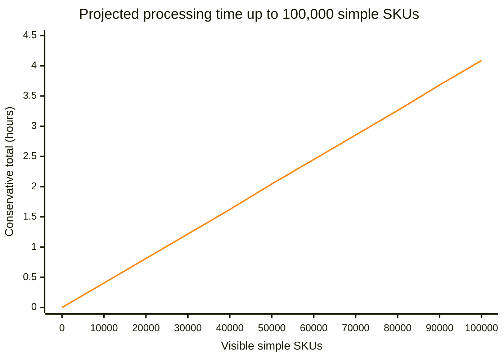
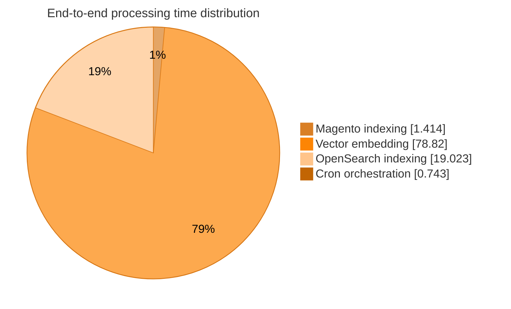

# Magento AI Search

[](https://github.com/DavidBelicza/Magento-AI-Search/actions/workflows/quality.yml)
[](https://codecov.io/gh/DavidBelicza/Magento-AI-Search)
[](https://packagist.org/packages/davidbel/magento-ai-search)
[](LICENSE)

What if there was a module using **Magento's default search engine** to provide **actual meaning-based AI search without breaking the default one**? This is that module.

Inspired by Google Cloud's Commerce AI Search, the module reads and chunks product descriptions, uses a remote AI server to **convert the text chunks into vectors**, then saves those vectors to **Magento's default search engine, OpenSearch**. This enables **intelligent search based on meaning rather than keyword or synonym matching**.

> Note that the AI Search module is currently in public beta.

## 🔍 What Semantic / AI Search Is

| Search query | Matching product descriptions |
|---|---|
| *coffee for cold winter mornings* | A rich dark roast with notes of cocoa and toasted spice.<br>A seasonal coffee blend with cinnamon, caramel, and a warming finish.<br>An insulated travel mug that keeps coffee hot throughout chilly days. |
| *big coats for small kids* | A roomy insulated parka for toddlers, with extra space for winter layers.<br>An oversized puffer coat for young children, with adjustable cuffs and a warm hood. |
| *gift for a home cook* | A balanced chef's knife for precise everyday preparation.<br>A durable bamboo cutting board with a deep juice groove.<br>A compact digital scale for accurate cooking and baking. |
| *I want to sleep better* | A weighted blanket designed for calm, comfortable nights.<br>Blackout curtains that reduce outside light in the bedroom. |
| *stay warm outdoors* | An insulated jacket designed for cold and windy conditions.<br>A breathable merino wool base layer for winter activities. |

## 🏗️ Architecture



- Magento's indexer detects product changes, reads the selected store-scoped content, splits
  it into chunks, and saves the documents and chunks locally.
- Scheduled workers send pending chunks to the AI server in batches, receive their vectors,
  and publish them to a versioned index in Magento's OpenSearch service.
- When a shopper searches, the AI server converts the query into a vector and OpenSearch
  finds products with similar meaning. Magento continues to handle the catalog query and
  result page.
- If semantic search is disabled or unavailable, the request falls back to Magento's default
  search.

## ⚙️ System requirements

### Distribution

| Distribution | Status |
|---|---|
| Magento Open Source | ✅ Supported |
| Adobe Commerce | 🧪 To be tested |
| Adobe Commerce on Cloud | 🧪 To be tested |
| Mage-OS | 🧪 To be tested |

### Magento

| Magento | PHP | OpenSearch | Status |
|---:|---:|---:|---|
| 2.4.9 | 8.5 | 3 | 🧪 To be tested |
| 2.4.9 | 8.5 | 2 | 🧪 To be tested |
| 2.4.9 | 8.4 | 3 | ✅ Supported |
| 2.4.9 | 8.4 | 2 | 🧪 To be tested |
| 2.4.8-p3+ | 8.4 | 3 | 🧪 To be tested |
| 2.4.8 | 8.4 | 2 | 🧪 To be tested |
| 2.4.8-p3+ | 8.3 | 3 | 🧪 To be tested |
| 2.4.8 | 8.3 | 2 | 🧪 To be tested |
| 2.4.7-p10 | 8.3 | 3 | 🧪 To be tested |
| 2.4.7 | 8.3 | 2 | 🧪 To be tested |

OpenSearch must include the k-NN plugin, which is bundled with the standard OpenSearch
distribution normally used with Magento.

### AI server

| Feature | Current support |
|---|---|
| Embedding models | ✅ Any model exposed through a supported endpoint (OpenAI text-embedding, Gemini Embedding, EmbeddingGemma, Cohere Embed, Voyage, Jina Embeddings, BGE, E5, GTE, Nomic Embed, Qwen Embedding, Mistral Embed, etc.) |
| API protocol | ✅ OpenAI-compatible APIs<br>✅ LM Studio<br>✅ Ollama<br>✅ llama.cpp<br>🚧 OpenAI hosted API planned<br>🚧 Google Gemini OpenAI-compatible API planned<br>🚧 Google Gemini native API planned |
| Authentication | ✅ Unauthenticated endpoints<br>🚧 Bearer-token authentication planned<br>🚧 Gemini API-key authentication planned |

## 📦 Install

```shell
composer require davidbel/magento-ai-search
bin/magento module:enable DavidBel_AiSearch
bin/magento setup:upgrade
```

## 🔧 Settings

The module settings are available in **Stores > Settings > Configuration > AI Search**.

## 📊 Performance

### Catalog Scaling

The estimates are based on a cron job scheduled to run every `60 seconds`, with `100`
chunks per embedding batch, up to `3` concurrent embedding requests, and a maximum
worker runtime of `600 seconds`. Each generated description contained approximately
`1,500 estimated tokens` and produced around `5` chunks. The chunks averaged about
`300 estimated tokens`, with a maximum size of `350 tokens` and an overlap of `50 tokens`.

| Visible simple SKUs | Vectors | Active processing | Conservative total |
|---:|---:|---:|---:|
| 1,000 | 6,000 | 2m 14s | **2m 14s** |
| 10,000 | 60,000 | 22m 20s | **24m 20s** |
| 100,000 | 600,000 | 3h 43m 16s | **4h 5m 16s** |
| 1,000,000 | 6,000,000 | 1d 13h 12m 35s | **1d 16h 55m 35s** |

The measurements show predictable linear scaling under the tested configuration, proving
that the worker architecture can support larger, long-running catalog workloads.



These estimates describe an initial full ingestion or a deliberate full rebuild of the
product content used for search. In normal operation, only changed content is processed,
and product descriptions usually change far less often than prices or inventory. Processing
an entire catalog is therefore an occasional workload, such as during initial setup, major
content campaigns, or embedding configuration changes, rather than a daily requirement.

### Time Distribution

The processing configuration can be tuned further for larger catalogs. However, most of the
computational work is performed by the AI server. These measurements used a local development
AI server; production servers typically scale further.



## 🗺️ Roadmap

| Planned feature | Area | Priority |
|---|---|---|
| **Automated index version switching** | Index versioning | Essential |
| **Avoiding duplicate embedding requests for identical chunk text** | Embedding | Essential |
| **Removing orphaned documents and chunks after product deletion or visibility changes** | Ingestion | Essential |
| **Handling failed deletion backlog items after the retry threshold** | Operations | Essential |
| **Reindexing documents after store creation, deletion, enabling, or disabling** | Store scope | Essential |
| **Attribute change detection for documents dependent on complex attributes** | Documents | Essential |
| **Search-result cache membership invalidation** | Storefront | Essential |
| **Authenticated OpenAI-compatible endpoints** | AI server | Planned |
| **Native Google Gemini API support** | AI server | Planned |
| **Store-view languages for dynamic documents** | Documents | Planned |
| **AI server configuration test** | Admin | Planned |
| **Document and chunk Admin grids** | Admin | Planned |
| **Semantic search testing in Admin** | Admin | Planned |
