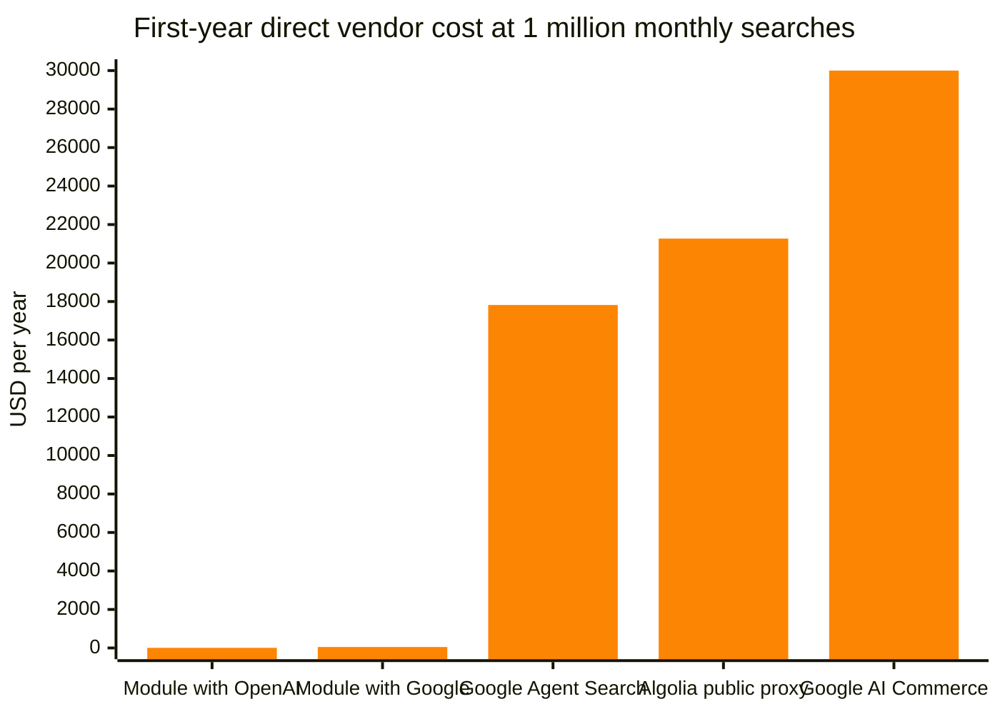

# Cost Analysis

> ## Up to 99.98% lower direct semantic-search vendor cost
>
> For a catalog of 100,000 products in two languages with 1 million submitted searches per
> month, using this module costs an estimated **$6.53 in the first year with OpenAI embeddings**
> or **$48.96 with Google Gemini Embedding**.
>
> Without this module, replacing Magento's existing search with the fully outsourced Google AI
> Commerce Search service costs approximately **$30,000 per year** at the same search volume.
> Under these assumptions, the module saves approximately **$29,951 to $29,993 per year** and
> reduces direct vendor cost by **99.84% to 99.98%**.

The module adds semantic search without introducing a second paid search platform. Magento
continues to provide catalog behavior, filters, layered navigation, pagination, and storefront
integration. The existing OpenSearch service stores and searches the vectors, so the only new
usage-based service is an embedding endpoint.

This analysis counts Magento and OpenSearch as existing infrastructure with no additional cost.
Pricing was researched on **27 August 2026** using public USD list prices before tax or discounts.
The analysis was prepared for version 1.0.0 of the module.

## Scope and assumptions

Google AI Commerce Search and Algolia also provide analytics, merchandising, personalization,
dashboards, support, and service commitments. The comparison excludes the financial value of these
additional features. It assumes the merchant already uses separate analytics and business
intelligence tools and focuses only on the incremental vendor cost of semantic search.

Managed availability still has value:

- Google AI Commerce Search and Algolia operate the complete hosted search service.
- With this module, Magento and OpenSearch remain part of the existing commerce platform, while
  the embedding provider operates the embedding endpoint.
- Adobe Commerce Cloud deployments include much of the required commerce and search
  infrastructure.
- Self-hosted deployments must review whether Magento and OpenSearch truly have no incremental
  operational cost.
- Magento's default search remains available as a storefront fallback.

## Base scenario

The primary calculation assumes:

- **100,000 simple products** in **two store views**, each using a different language
- **200,000 product-language documents**, with one description document per product and store view
- Product name used as the embedding document title
- Approximately **500 parsed description tokens**, or **2,000 parsed characters**, per product
- Maximum chunk size of **350 estimated tokens** with **50 estimated tokens** of overlap
- Approximately **570 billed tokens** per product-language document after chunk overlap and
  embedding request template overhead
- **768 vector dimensions** for the illustrative vector-storage calculation
- Approximately **12 billed tokens** per templated search query
- **1 million submitted semantic searches per month**
- **5% of product-language documents updated per month**
- Existing Magento and OpenSearch infrastructure counted as **$0 additional cost**

The 500-token assumption represents a moderate product description using the module's
four-characters-per-token estimator. Current defaults are defined in
[`etc/config.xml`](../etc/config.xml).

## Embedding workload

| Workload | Calculation | Tokens |
|---|---:|---:|
| Initial catalog | 100,000 products x 2 store views x 570 tokens | 114 million |
| Monthly document updates | 114 million x 5% | 5.7 million |
| Monthly queries | 1 million searches x 12 tokens | 12 million |
| **Total recurring workload** | Updates plus queries | **17.7 million per month** |

## First-year cost comparison

| Solution | Initial catalog cost | Recurring monthly cost | First-year cost | Pricing status |
|---|---:|---:|---:|---|
| **Module with OpenAI `text-embedding-3-small`** | $2.28 | $0.35 | **$6.53** | Public token price |
| **Module with Google Gemini Embedding** | $17.10 | $2.66 | **$48.96** | Public online token price |
| **Google Agent Search Standard** | Within included storage | $1,485.00 | **$17,820.00** | Generic managed semantic retrieval |
| **Google AI Commerce Search** | Catalog management is free | $2,500.00 | **$30,000.00** | Managed commerce search |
| **Algolia NeuralSearch** | Quote required | Quote required | **Quote required** | Elevate custom annual plan |
| **Algolia Grow Plus public proxy** | Included in monthly record charge | $1,772.50 | **$21,270.00** | Does not include NeuralSearch |

The module costs include initial catalog ingestion and twelve recurring months:

```text
OpenAI: $2.28 + (12 x $0.354) = $6.528
Google Gemini: $17.10 + (12 x $2.655) = $48.96
```

## Annual cost chart



The module bars appear almost flat because the managed services cost hundreds
or thousands of times more on the same linear scale.

## Cost by search volume

These recurring monthly estimates exclude initial catalog ingestion and include a 5%
product-content update rate. Hosted search costs use submitted search requests only.

| Submitted searches per month | Module with OpenAI | Module with Google | Google Agent Search | Google AI Commerce | Algolia Grow Plus proxy |
|---:|---:|---:|---:|---:|---:|
| 100,000 | $0.14 | $1.04 | $135.00 | $250.00 | $197.50 |
| 1,000,000 | $0.35 | $2.66 | $1,485.00 | $2,500.00 | $1,772.50 |
| 10,000,000 | $2.51 | $18.86 | $14,985.00 | $25,000.00 | $17,522.50 |

One submitted search is counted as one request. Autocomplete keystrokes, category browsing, and
additional facet requests are excluded. Google AI Commerce Search also charges for browse
requests, while search-as-you-type can increase Algolia request volume.

## Initial embedding cost by description length

| Parsed description size | Estimated billed catalog tokens | OpenAI small | OpenAI large | Google Gemini |
|---:|---:|---:|---:|---:|
| 400 tokens | 94 million | $1.88 | $12.22 | $14.10 |
| 500 tokens | 114 million | $2.28 | $14.82 | $17.10 |
| 800 tokens | 186 million | $3.72 | $24.18 | $27.90 |

Each complete rebuild adds one initial-catalog embedding charge. At the 500-token base size, that
is approximately **$2.28 with OpenAI small** or **$17.10 with Google Gemini Embedding**.

## Provider pricing

### OpenAI embeddings

OpenAI lists `text-embedding-3-small` at **$0.02 per million input tokens** and
`text-embedding-3-large` at **$0.13 per million input tokens**. The headline calculation uses the
small model.

Source: [OpenAI text-embedding-3-small model pricing](https://developers.openai.com/api/docs/models/text-embedding-3-small)

### Google embeddings

Google lists Gemini Embedding online input at **$0.00015 per 1,000 tokens**, equal to **$0.15 per
million tokens**, with no separate output charge. The headline calculation uses the Gemini
Embedding model supported by the module's native Google client.

Source: [Google embedding pricing](https://cloud.google.com/vertex-ai/generative-ai/pricing)

## Managed search alternatives

### Google AI Commerce Search

Google charges **$2.50 per 1,000 search or browse requests** and does not charge for catalog import
or management. One million monthly search requests cost **$2,500 per month**, or **$30,000 per
year**. Multiple languages can increase catalog records, but request volume remains the main cost.

Source: [Google AI Commerce Search pricing](https://cloud.google.com/products/retail/pricing)

### Google Agent Search Standard

Google Agent Search Standard is a general managed semantic retrieval service. It costs **$1.50 per
1,000 queries**, with 10,000 monthly queries free. One million monthly queries therefore cost
**$1,485 per month**, or **$17,820 per year**. Its first 10 GiB of monthly index storage is free and
covers the estimated storage in the base scenario.

Source: [Google Agent Search pricing](https://cloud.google.com/generative-ai-app-builder/pricing)

### Google Vertex AI Vector Search

Vertex AI Vector Search is vector-serving infrastructure, not a complete commerce search service.
A small `e2-standard-2` serving node is approximately **$68.48 per 730-hour month**. Assuming two
chunks for each of the 200,000 product-language documents, 400,000 vectors with 768 dimensions
require roughly 1.14 GiB of raw vector data. At $3 per GiB, one index build costs approximately
**$3.43**.

A complete solution would still need product metadata, filtering, facets, pagination, APIs,
synchronization, monitoring, redundancy, and engineering.

Source: [Google Vertex AI Vector Search pricing](https://cloud.google.com/products/gemini-enterprise-agent-platform/pricing)

### Algolia

Algolia offers semantic search through NeuralSearch, but only the custom-priced Elevate annual plan
includes it. An exact comparison therefore requires a commercial quote.

Grow Plus is a public scale reference, not a NeuralSearch price. It includes 10,000 monthly search
requests and 100,000 records, then charges $1.75 per additional 1,000 requests and $0.40 per
additional 1,000 records. At 200,000 records and 1 million monthly requests, the public proxy is
**$1,772.50 per month**, or **$21,270 per year**.

Sources: [Algolia pricing](https://www.algolia.com/pricing), [Algolia record and request counting](https://support.algolia.com/hc/en-us/articles/17245378392977-How-does-Algolia-count-records-and-operations)

## Conclusion

For merchants already operating Magento and OpenSearch, catalog size adds little direct semantic
search cost when the only new bill is embedding input. Managed search services charge primarily
for ongoing traffic, stored records, and hosted operations. Their broader features may justify the
price for some merchants, while this module focuses on reusing the platform the merchant already
operates.

## Limitations

This analysis excludes:

- Existing Magento, Adobe Commerce, OpenSearch, hosting, and operational costs
- Engineering, integration, monitoring, backups, network egress, and support agreements
- Taxes, currency conversion, negotiated prices, and committed-use discounts
- Differences between the module's token estimate and each provider's billed token count
- Revenue effects from differences in relevance or merchandising capabilities
- Autocomplete, browse, facet, recommendation, and category-page requests
- Algolia NeuralSearch, because its exact price requires a commercial quote

This is a direct incremental vendor-cost comparison, not a complete total-cost-of-ownership study.

## Reproducible formulas

```text
Product-language documents = products x indexed store views

Initial embedding tokens =
    product-language documents x billed tokens per document

Monthly update tokens =
    initial embedding tokens x monthly content-change rate

Monthly query tokens =
    submitted searches x billed tokens per templated query

First-year embedding cost =
    initial embedding tokens x provider token price
    + 12 x (monthly update tokens + monthly query tokens) x provider token price

Managed search annual cost =
    monthly billable search requests / 1,000 x request price x 12
    + annual record or storage charges
```

Merchant-specific estimates depend most on product and store-view counts, description length,
chunking settings, document sources, content-update frequency, rebuild frequency, submitted search
volume, autocomplete behavior, and the selected embedding model.

## Disclaimer

This document is provided for informational purposes only. It is not executable code, a price
offer, a quotation, a contractual commitment, or a guarantee of costs or savings. Provider prices,
billing methods, service terms, and actual usage may change. The merchant is responsible for
verifying current prices, estimating usage, selecting services, and paying all resulting costs.
