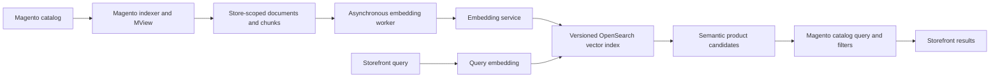

<!--
  davidbel/magento-ai-search by David Belicza
  SPDX-License-Identifier: MIT
  https://github.com/DavidBelicza/Magento-AI-Search
-->

# Semantic Search Solution Discovery

**Original research date:** 25 July 2026

**Scope:** Magento Open Source, Adobe Commerce, Mage-OS, OpenSearch, Meilisearch, MariaDB
Vector, embedding services, and extensibility beyond product search

This document records the solution options evaluated before the architecture of Magento AI Search
was selected. It reflects the products and platform capabilities available on the original research
date and is not a current compatibility or pricing matrix.

## Objective

The discovery sought a practical way to add meaning-based search to Magento without requiring a
separate hosted vector database or replacing Magento's catalog behavior. The preferred solution
needed to:

- preserve Magento's filters, visibility rules, layered navigation, pagination, and storefront
  integration;
- avoid external network calls during product-save transactions;
- support asynchronous, resumable document processing and embedding;
- reuse existing infrastructure where practical;
- support store-scoped content and future document sources;
- allow safe model, vector-dimension, and index-schema changes;
- keep the embedding provider separate from vector storage.

## Capabilities that must remain separate

Semantic search involves three independent capabilities:

| Capability | Responsibility | Required for semantic search |
|---|---|---:|
| Embedding model | Converts documents and queries into vectors | Yes |
| Vector search engine | Stores vectors and finds similar documents | Yes |
| Large language model | Generates answers, summaries, or conversational output | No |

An embedding API does not need to store catalog data, and a large language model is not required to
rank products. Keeping these responsibilities separate allows Magento to use a remote or local
embedding service while retaining control of catalog data and search behavior.

## Solutions considered

| Solution | Infrastructure impact | Main advantage | Main limitation | Discovery outcome |
|---|---|---|---|---|
| Parallel OpenSearch vector index | Reuses Magento's OpenSearch service | Isolated vector schema and lifecycle without replacing Magento search | Semantic candidates must be combined with Magento's catalog query | **Selected** |
| Vectors in Magento's catalog-search index | Reuses Magento's OpenSearch service | Product data, filters, and vectors can share one query | Deep coupling to Magento's private mapping, adapter, and index-replacement behavior | Not selected |
| Meilisearch with Walkwizus | Replaces OpenSearch with Meilisearch | Existing Magento integration with semantic and hybrid search | Replaces the default search engine and introduces a third-party integration dependency | Alternative solution |
| MariaDB Vector | Adds vector storage to a compatible MariaDB server | Native SQL filtering and indexed vector search | Magento still needs a catalog search engine, and vector schema requires database-specific handling | Specialized option |
| Application-side vector comparison | Stores vectors as ordinary data | Simple proof of concept | Linear scans do not scale for production catalogs | Prototype only |

## Option 1: OpenSearch

OpenSearch was the strongest fit because supported Magento installations already require a search
engine. Its k-NN functionality provides vector fields, approximate nearest-neighbor search,
filtering, and hybrid retrieval without adding another persistent service.

Two OpenSearch integration patterns were considered.

### Extend Magento's catalog-search index

This approach adds vectors to Magento's existing product documents and modifies the catalog query.
It can perform keyword, vector, and attribute filtering in one request.

The tradeoff is tight coupling to Magento's internal index mapping and replacement lifecycle. Every
catalog-search rebuild must preserve the custom vector field, and changes to Magento's search
adapter can affect the integration. Multiple chunks or non-product documents also fit poorly into
one product record.

### Maintain a parallel semantic index

This approach gives the module its own vector mapping, physical index versions, and stable search
alias. Magento continues to own catalog filtering and storefront behavior, while the semantic index
returns product candidates and relevance scores.

The separation supports multiple chunks per product, independent rebuilds, model migrations, and
future document types. It also keeps Magento's catalog-search index and adapter intact. The cost is
that semantic candidates must be combined with Magento's catalog query rather than resolved by one
self-contained vector request.

The parallel-index approach was selected for this module.

## Option 2: Meilisearch with Walkwizus

The Walkwizus Magento integration replaces Magento's OpenSearch engine with Meilisearch. At the
time of discovery, it already provided Magento indexing, index configuration, faceting,
merchandising, and semantic-search settings.

Meilisearch can act as both the text search engine and vector store. It can generate embeddings
through configured providers and combine keyword and semantic results. This makes it a fast route
to an integrated semantic product search when replacing OpenSearch is acceptable.

It was not selected because this project aimed to retain Magento's default search engine and avoid
making a replacement search adapter the foundation of the module. Meilisearch remains a credible
alternative for projects that prefer its integrated search model.

## Option 3: MariaDB Vector

MariaDB introduced native vector columns and HNSW indexing in version 11.7. On a compatible server,
it can perform indexed vector similarity and ordinary SQL filtering in the same query.

It was not selected as the primary backend for several reasons:

- Magento's declarative schema does not define a portable vector column or vector-index type;
- custom database-specific DDL would be required;
- Magento still requires a supported catalog search engine;
- semantic-search load would share resources with the transactional commerce database;
- derived vectors do not belong in product EAV attributes;
- supporting MySQL and older MariaDB versions would require another storage path.

MariaDB Vector remains suitable for controlled deployments, experiments, or separate retrieval
corpora where database-specific coupling is acceptable.

## Selected architecture

The discovery produced the following architecture:

The important boundaries are:

- Magento indexers detect catalog changes and build deterministic local documents and chunks.
- External embedding work runs asynchronously and does not block catalog saves.
- OpenSearch stores vectors in a module-owned, versioned index.
- The storefront uses the same embedding model for queries and documents.
- Magento remains responsible for catalog eligibility, filters, and result presentation.
- A model, dimension, mapping, chunking, or document-template change requires a new vector index
  version.

## Product and content modeling

The discovery recommended treating embeddings as derived search data rather than catalog
attributes. Source attributes such as name, description, brand, material, and intended use can be
combined into natural embedding documents, while exact values remain separately filterable by
Magento.

Long content should be divided into deterministic chunks. Search can rank matching chunks and then
collapse them to their parent product or content entity. Store ID, source type, entity ID, model
configuration, and content identity must remain explicit throughout the pipeline.

The same architecture can later support CMS pages, FAQs, articles, manuals, or custom entities.
Those additions require their own change detection, store assignment, permissions, URLs, and result
rendering. They do not require replacing the embedding or vector-publication pipeline.

## Search behavior considered

The research considered both pure semantic search and hybrid keyword-semantic ranking. Hybrid
ranking is generally stronger for catalogs containing exact SKUs, model numbers, product names, or
other identifiers that lexical search handles well.

Regardless of the ranking method, store assignment, visibility, availability, customer access, and
other business rules must remain structured filters. Encoding these rules only in text embeddings
would make them unreliable and difficult to update.

The current module focuses on semantic relevance while preserving Magento's catalog query and
fallback behavior. Broader ranking strategies remain separate implementation choices rather than
requirements of the vector-storage architecture.

## Extensibility opportunities

The evaluated architecture can support future work in several directions:

- additional product attributes and configurable document templates;
- CMS, FAQ, article, and manual indexing;
- grouped or federated results across content types;
- hybrid lexical and semantic ranking;
- query-vector caching and persistent document-vector reuse;
- optional Meilisearch or specialized vector backends;
- permission-aware retrieval for restricted content;
- optional retrieval-augmented answers with cited Magento entities.

These are discovery outcomes, not commitments or statements of current module support.

## Decision summary

OpenSearch with a parallel semantic index offered the cleanest balance for a reusable Magento
module:

1. It reused infrastructure already present in supported Magento environments.
2. It avoided replacing Magento's catalog-search adapter.
3. It allowed independent vector mappings, chunks, versioning, and model migration.
4. It kept remote embedding work outside Magento save transactions.
5. It preserved Magento as the authority for catalog behavior and storefront integration.

Meilisearch with Walkwizus remained the strongest replacement-engine alternative. MariaDB Vector
was technically viable but introduced portability and operational tradeoffs without removing the
need for Magento's catalog search engine.

## References

### Magento and Mage-OS

- [Adobe Commerce system requirements](https://experienceleague.adobe.com/en/docs/commerce-operations/installation-guide/system-requirements)
- [Adobe Commerce search engine prerequisites](https://experienceleague.adobe.com/en/docs/commerce-operations/installation-guide/prerequisites/search-engine/overview)
- [Magento indexing architecture](https://developer.adobe.com/commerce/php/development/components/indexing/)
- [Mage-OS system requirements](https://mage-os.org/get-started/system-requirements/)

### OpenSearch

- [OpenSearch vector search](https://docs.opensearch.org/latest/vector-search/)
- [OpenSearch k-NN vector mapping](https://docs.opensearch.org/latest/mappings/supported-field-types/knn-vector/)
- [OpenSearch hybrid search](https://docs.opensearch.org/latest/vector-search/ai-search/hybrid-search/index/)
- [OpenSearch vector filtering](https://docs.opensearch.org/latest/vector-search/filter-search-knn/index/)

### Meilisearch and Walkwizus

- [Walkwizus Magento Meilisearch module](https://github.com/walkwizus/magento2-module-meilisearch)
- [Walkwizus module documentation](https://walkwizus.github.io/magento2-module-meilisearch-docs/)
- [Meilisearch hybrid search](https://www.meilisearch.com/docs/capabilities/hybrid_search/advanced/semantic_vs_hybrid)
- [Meilisearch federated search](https://www.meilisearch.com/docs/capabilities/multi_search/getting_started/federated_search)

### MariaDB

- [MariaDB Vector overview](https://mariadb.com/docs/server/reference/sql-structure/vectors/vector-overview)
